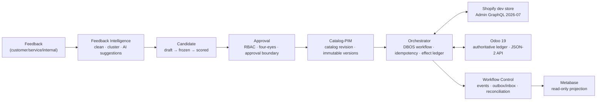

# Commerce Orchestrator — E-commerce Operations Control Tower

[](https://github.com/ratiolin/commerce-orchestrator/actions/workflows/ci.yml) [](https://sonarcloud.io/summary/new_code?id=metratio_commerce-orchestrator) [](https://sonarcloud.io/summary/new_code?id=metratio_commerce-orchestrator) [](LICENSE) [](backend/pyproject.toml) [](console/package.json)
- [Code of conduct](CODE_OF_CONDUCT.md) - [Contributing](CONTRIBUTING.md) - [MIT license](LICENSE) - [Security](SECURITY.md)


A personal full-stack experimental project: verifies cross-system workflow orchestration, candidate/approval, idempotency, effect ledger, and reconciliation with simulated data + a Shopify development store + an Odoo 19 sandbox. No real users and no real orders; no production promotion path; kept running for learning and iteration.

> Repository documentation is in English; code, paths, commands, and English identifiers stay as-is.

## Positioning and responsibility boundary

**What it does**

- Orchestrates cross-system business flows into reliable, auditable, rollback-able long-running processes: feedback → clustering → AI candidate → approval → catalog/PIM → channel publishing → effect accounting → reconciliation loop.
- Candidate version management (draft → candidate → frozen → scored → official | rejected → deprecated) with approval control (RBAC, four-eyes principle, approval boundaries, compliance veto).
- Idempotent effect execution against external channels (Shopify), with full effect-ledger accounting and daily reconciliation.
- Product, inventory, order, and financial data integration with Odoo 19 as the authoritative ledger; Metabase as a read-only projection for operations views.

**What it does not do**

- Does not replace Odoo / Shopify: Odoo is the authoritative ledger, Shopify is the first channel; this system does not duplicate their business master data.
- Does not do financial accounting itself: invoice/bill posting still happens in Odoo and accounting; posted invoices can only be corrected through credit notes.
- AI only generates suggestions; it does not approve or execute any external effect.
- Does not do dynamic pricing, real-time recommendation, or other capabilities not on the v1 list (see "Explicitly not in v1" below).

## Architecture overview



## Tech stack

| Layer | Choice | Notes |
|---|---|---|
| Backend | Python 3.12 / FastAPI / Pydantic / SQLAlchemy 2 / Alembic / uv | API and worker share one image, separate processes |
| Long-running engine | DBOS OSS + dedicated PostgreSQL | Workflows resume from the last completed step; steps at-least-once, transactions exactly-once |
| Channel integration | Shopify Admin GraphQL (frozen 2026-07); Odoo 19 External JSON-2 API | See ADR-0007 / ADR-0008 |
| Frontend | Next.js (React) + TypeScript | Operations console; BFF secure session (HttpOnly cookie + CSRF + allowlist proxy, ADR-0014) |
| Observability | OpenTelemetry / Prometheus / Grafana / Alertmanager | correlationId throughout; 10 alert rules with runbook links, test environment delivers only to the local receiver |
| Health/ops | `/livez` `/readyz` `/healthz` `/v1/me` `/v1/ops/*` | readiness includes DB/Alembic/adapter/worker heartbeat; ops only for system_admin |
| Orchestration | Docker Compose | v1 introduces no Redis / RabbitMQ / Kafka / ES / K8s |

The dependency snapshot is authoritative in `backend/uv.lock` (fastapi 0.141.1, uvicorn 0.52.1, pydantic 2.13.4, sqlalchemy 2.0.51, alembic 1.19.1, psycopg 3.3.4, structlog 26.1.0, pyjwt 2.13.0, cryptography 49.0.0, uuid6 2025.0.1, OTEL 1.44.x, dbos 2.29).

## Repository layout

```
commerce-orchestrator/
├── README.md            # this file (project overview)
├── compose.yaml         # Docker Compose full-stack orchestration
├── Makefile             # common command entry
├── .env.example         # environment variable sample (no secrets)
├── .github/             # CI workflows
├── backend/             # Python backend (FastAPI + DBOS)
│   ├── app/             # application code (api/worker shared)
│   ├── alembic/         # database migrations
│   ├── tests/           # tests
│   └── README.md        # backend development notes
├── console/             # Next.js operations console
│   └── README.md
├── services/            # merged standalone services (2026-08-14; included into the same project via compose.yaml include)
│   ├── catalog/         # product listing operations automation
│   └── feedback/        # structured customer-feedback analysis
├── infra/               # infrastructure: PostgreSQL, monitoring, etc.
│   └── README.md
└── docs/                # documentation
    ├── glossary.md      # domain glossary
    ├── architecture.md  # overall architecture and trust boundaries
    ├── development.md   # development and contract-change process
    ├── adr/             # architecture decision records (0001-0015)
    ├── runbooks/        # operations runbooks (environment/backup/reconciliation)
    └── contracts/       # single source of truth for contracts (API/events/data ownership)
```

## Quick start

**Option 1: Docker Compose full stack (recommended for integration/demo)**

```bash
docker compose up -d     # empty data volumes automatically: postgres → db-bootstrap → migrate → api+worker → console+monitoring; services/ (catalog, feedback) join the same compose project via include (see services/*/README.md)
```

Service list, health checks, and data directories: see [infra/README.md](infra/README.md).

Odoo 19 is not started by default: `docker compose --profile odoo up -d`.

**Option 2: local development**

```bash
# 1) start only dependencies (PostgreSQL etc.)
docker compose up -d postgres

# 2) backend (full notes in backend/README.md)
cd backend
uv sync
uv run alembic upgrade head
uv run uvicorn app.main:app --reload

# 3) console (full notes in console/README.md)
cd ../console
npm install
npm run dev
```

Environment variables: all come from the environment (`backend/.env` or process env), sample in `.env.example`; real secrets must never be committed.

> New commands all go through the single mainline of **API accept → inbox relay → DBOS v2 workflow → typed effect seam → canonical reconciliation**; worker bootstrap/DBOS launch failure exits non-zero (fail-closed). See ADR-0011/0012/0013.

## Domain fact ownership

Every domain has a single fact owner; cross-system projections must carry `sourceRevision` / `observedAt` / `owner`; last-writer-wins is forbidden. Contract details: [docs/contracts/data-ownership.md](docs/contracts/data-ownership.md).

| Domain | Fact owner | Authoritative facts | Notes |
|---|---|---|---|
| Feedback Intelligence | Feedback domain | Structured feedback, clustering results, AI candidate suggestions | AI suggests only; does not approve or execute |
| Operating Policy | Policy domain | Approval boundaries, SOPs, sensitive-category rules | compliance maintains and vetoes |
| Catalog-PIM | Catalog domain | Product content/listing revisions and immutable versions | approved by catalog_owner |
| Offer&Pricing | Pricing domain | Price/promotion rules | price changes approved by commerce_lead |
| Shopify | Channel adapter | Shopify-side product/order/refund state | Admin GraphQL frozen 2026-07 |
| Odoo Product | Odoo integration | Product master data (Odoo authoritative) | External JSON-2 API |
| Inventory | Inventory domain | Stock quantities (changed only by stock move/adjustment) | approved by inventory_supervisor |
| Sales-Purchase | Transaction domain | Orders, POs, receiving/shipping | four-eyes principle |
| Finance | Finance domain | Invoices/bills/credit notes (Odoo authoritative ledger) | after posting, corrected only by credit note |
| Workflow Control | Workflow control | workflows / events / effect ledger / idempotency records | DBOS OSS + PostgreSQL |
| Metabase | Read-only projection | Operations dashboards (rebuildable) | not authoritative; writes forbidden |

## Core state machine summary

- **AI candidate**: `draft → candidate → frozen → scored → official | rejected → deprecated`; once frozen, the original candidate cannot be modified.
- **Effect**: `planned → dispatched → succeeded | failed | outcome_unknown → reconciled | manual_reconciliation`.
- **Workflow**: `accepted → running → awaiting_approval → running → completed | needs_reconciliation | failed | cancelled`; `needs_reconciliation` is not a failed terminal state (outcome_unknown/cross-system differences need human handling).
- **inbox relay**: `pending → processing → processed | failed` (lease 30s / exponential backoff ≤10 attempts / startup reclaim of expired leases).
- **Catalog revision**: `catalog.revision_drafted → normalized → validated → approved → official → superseded`.

## Explicitly not in v1

- No DBOS Conductor; no multi-node scheduling; evaluate Temporal/Hatchet when needed later, do not build a self-made control plane.
- No Redis / RabbitMQ / Kafka / Elasticsearch / K8s.
- No last-writer-wins conflict merging; reconciliation differences are forbidden to auto-flatten; **a skipped domain is not success** (a required domain missing a reader fails the whole run).
- Only one external channel: the Shopify development store.
- Odoo External JSON-2 API does not enter the write phase until tested against a real Community container; no expansion of XML-RPC / `/jsonrpc` dependencies.
- AI does not auto-approve or execute any effect.
- No automatic reverse compensation: `outcome_unknown` is not blindly resent; it enters `needs_reconciliation` for human handling; invoices are corrected only by credit notes, inventory only by stock move/adjustment.
- The console no longer puts JWT into `localStorage`; the browser only accesses the same-origin BFF.
- No dynamic pricing, real-time price engine, or multi-channel aggregation.
- No new self-made queue or self-made control plane.

## Acceptance-gate highlights

- **Fault tests**: single effect replay 10 times without duplicate side effects; 1000 kill-injection runs meet metric targets; restart recovery ≤ 5 minutes; 30-day human-approval waits occupy no worker slot; every difference enters `MANUAL_RECONCILIATION`.
- **Performance gates**: p95/p99 and stress-test baselines pass (see ADR-0010).

## Documentation navigation

| Document | Content |
|---|---|
| [docs/glossary.md](docs/glossary.md) | Domain glossary (Chinese terms + English identifiers) |
| [docs/architecture.md](docs/architecture.md) | Overall architecture, trust boundaries, reliability model, first vertical slice in 21 steps |
| [docs/development.md](docs/development.md) | Development conventions, contract-change process, ADR process |
| [docs/adr/](docs/adr/) | Architecture decision records (0001-0015; 0011-0014 added by the DBOS v2 single-mainline overhaul, 0015 is the personal-experiment positioning) |
| [docs/runbooks/](docs/runbooks/) | Operations runbooks (dev-environment / backup-restore / reconciliation-drift / worker-failure / privacy-cleanup / alerting) |
| [docs/contracts/](docs/contracts/) | **Single source of truth for contracts** (api-contract / event-contract / data-ownership) |
| backend/README.md | Backend development notes |
| console/README.md | Console development notes |
| infra/README.md | Infrastructure and Compose service notes |
