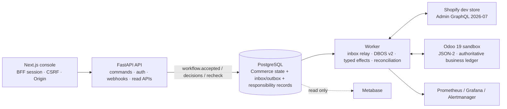

# Commerce Orchestrator — E-commerce Operations Control Tower

[](https://github.com/xiongweilin/commerce-orchestrator/actions/workflows/ci.yml) [](https://sonarcloud.io/summary/new_code?id=metratio_commerce-orchestrator) [](https://sonarcloud.io/summary/new_code?id=metratio_commerce-orchestrator) [](LICENSE) [](backend/pyproject.toml) [](console/package.json)

A personal full-stack sandbox for durable, governed cross-system commerce workflows. It uses simulated data, a Shopify development store and an Odoo 19 sandbox. There are no real users, no real orders and no production-promotion path; the stack is kept running for engineering experiments and iteration.

## What the project is now

The repository started as a workflow control tower around candidate approval, idempotency, an effect ledger and reconciliation. The current code also contains an explicit **responsibility / authority plane** around durable execution.

The core chain is now:

```text
Evidence / AI candidate
        |
        v
Decision
        |
        v
ExecutionAuthorization
        |
        v
DBOS durable workflow
        |
        v
Typed effect + Effect Ledger
        |
        v
Shopify / Odoo
        |
        v
Reality verification + canonical reconciliation
        |
        v
ConfirmedOutcome where required
        |
        v
Declared-scope bounded completion
```

AI is still deliberately bounded: it may generate candidate suggestions, but it does not approve, mint execution authority, execute external effects or rewrite authoritative business facts.

## Repository ownership boundary

The repository consumes generic portable responsibility contracts but owns only its Commerce specialization and business/runtime boundary:

```text
portable-runtime/contracts
= generic downstream portable product contracts consumed here

commerce-orchestrator
= Commerce specialization + business fact ownership mappings
  + DBOS workflow/effect transaction boundary
  + Shopify/Odoo adapters and reality verification

DBOS
= durable execution substrate used by this repository
```

`portable-runtime` does not replace DBOS or re-own Shopify/Odoo facts. `ratio/责任拓扑` and `responsibility_topology` may provide upstream design/research lineage, but neither is a runtime dependency or Commerce fact owner. The exact portable compatibility baseline remains the versioned pin in `docs/contracts/responsibility-compatibility.toml`; it is advanced only when required contracts change and compatibility is revalidated, not merely because upstream `main` has newer documentation or experiments.

## Current design invariants

The implementation intentionally keeps these facts separate:

- AI candidate != Decision
- ExperienceUseAdmission.allowed != Decision
- Decision != ExecutionAuthorization
- PublicationQualification.qualified != Authorization
- EffectLedger.succeeded != ConfirmedOutcome
- reconciliation disposition != verified repair
- WorkflowRun.completed != universal responsibility discharge
- client/console inference != execution authority

For the detailed semantic contract, see [`docs/contracts/responsibility-alignment.md`](docs/contracts/responsibility-alignment.md).

## Runtime architecture



The API and worker share the backend codebase but have separate responsibilities. API requests record/validate commands; the worker owns durable orchestration and external side effects.

## Durable workflow mainline

All new command/webhook flows use DBOS v2:

```text
API/webhook accept
  -> workflow.accepted
  -> inbox relay
  -> DBOS workflow
  -> durable approval wait when required
  -> typed effect dispatch
  -> external read-back / realization verification
  -> canonical reconciliation
  -> bounded completion assessment
```

Workflow state:

```text
accepted -> running -> awaiting_approval -> running
         -> completed | needs_reconciliation | failed | cancelled
```

`needs_reconciliation` is not a failed terminal state. `outcome_unknown` is never blindly resent.

## Decision vs execution authority

Ordinary decisions use:

```text
POST /v1/work-items/{id}/decisions
```

If a work item requires execution authority, approve must use:

```text
POST /v1/work-items/{id}/authorized-decisions
```

The server records the Decision and mints a separate exact-scope `ExecutionAuthorization` in one transaction. Current authorization profiles are:

| Profile | Target | Operations |
| --- | --- | --- |
| `listing-publication-v1` | Shopify | `shopify.product_publish` |
| `return-credit-note-v1` | Odoo | `odoo.credit_note_create`, `odoo.credit_note_validate` |
| `return-refund-v1` | Shopify | `shopify.refund_create` |

Dispatch revalidates subject version/fingerprint, target, allowed operation, policy/environment and expiry/revocation. A historical approval or role membership is not inferred as current authority.

## CURRENT vs HISTORICAL responsibility

`GET /v1/workflows/{workflow_id}/responsibility` exposes a non-authoritative Responsibility Inspector.

For listing publication:

- `historical` records what Experience/knowledge state was actually relied on at the time;
- `currentResponsibility` re-evaluates current authorization, publication qualification, Experience-use status and open obligations;
- the same server explanation path is used by publication dispatch eligibility, reducing UI/enforcement drift.

Discharged responsibility obligations remain in history; only the open subset appears under `openResponsibility`.

## Execution, reality and completion

An adapter success is not automatically a business outcome:

```text
EffectLedger.succeeded
        !=
EffectRealizationAssessment.VERIFIED
        !=
ConfirmedOutcome
```

A `ConfirmedOutcome` requires explicit verified realization evidence.

Workflow completion is also deliberately bounded. `backend/app/services/workflow_completion.py` evaluates finite per-workflow requirements and reports the permanent coverage claim `declared-scope-only`. If completion is blocked on missing current evidence, an authorized user may request a durable reassessment through:

```text
POST /v1/workflows/{workflow_id}/completion-recheck
```

The recheck request does not invent evidence or directly mark the workflow complete.

## Canonical reconciliation

Canonical reconciliation covers:

`listing` · `order` · `procurement` · `return` · `catalog` · `effect`

Rules:

- missing required reader => failure, not success;
- zero diff requires checked rows or explicit proof of emptiness for each required domain;
- reconciliation differences are never auto-smoothed;
- manual resolution records a disposition, but subsequent external read-back/reconciliation is needed to prove repair.

## Tech stack

| Layer | Current choice |
| --- | --- |
| Backend | Python 3.12 / FastAPI / Pydantic v2 / SQLAlchemy 2 / Alembic / uv |
| Durable workflow | DBOS OSS + PostgreSQL |
| External systems | Shopify Admin GraphQL 2026-07 / Odoo 19 JSON-2 |
| Frontend | Next.js 16 / React 19 / TypeScript |
| Auth/session | FastAPI JWT/RBAC + Next.js same-origin BFF session |
| Observability | OpenTelemetry / Prometheus / Grafana / Alertmanager |
| Analytics | Metabase read-only projection |
| Local orchestration | Docker Compose |

The dependency lock is `backend/uv.lock`. The database migration chain currently extends through `0010_responsibility_workflow_refs.py`; do not assume `0001_initial.py` represents the whole current schema.

## Repository layout

```text
commerce-orchestrator/
├── backend/                  FastAPI + worker + DBOS workflows + models/services
├── console/                  Next.js operations console and Responsibility Inspector
├── services/                 feedback/catalog companion services
├── infra/                    PostgreSQL/monitoring/Compose infrastructure
├── docs/
│   ├── current-implementation.md
│   ├── architecture.md
│   ├── architecture/responsibility-layering.md
│   ├── contracts/
│   ├── adr/
│   └── runbooks/
├── compose.yaml
└── Makefile
```

## Quick start

Full stack:

```bash
docker compose up -d
```

Odoo 19 sandbox profile:

```bash
docker compose --profile odoo up -d
```

Local backend:

```bash
cd backend
uv sync
uv run alembic upgrade head
uv run uvicorn app.main:app --reload
```

Worker:

```bash
cd backend
uv run python -m app.worker
```

Console:

```bash
cd console
npm install
npm run dev
```

## Documentation map

| Document | Purpose |
| --- | --- |
| [`docs/current-implementation.md`](docs/current-implementation.md) | Current code-oriented implementation snapshot |
| [`docs/architecture.md`](docs/architecture.md) | Runtime architecture, trust boundaries and execution model |
| [`docs/architecture/responsibility-layering.md`](docs/architecture/responsibility-layering.md) | Responsibility/authority layering |
| [`docs/contracts/api-contract.md`](docs/contracts/api-contract.md) | HTTP behavior contract; exact JSON schema is FastAPI OpenAPI |
| [`docs/contracts/event-contract.md`](docs/contracts/event-contract.md) | Event names and effect operation vocabulary |
| [`docs/contracts/data-ownership.md`](docs/contracts/data-ownership.md) | Fact ownership and write boundaries |
| [`docs/contracts/responsibility-alignment.md`](docs/contracts/responsibility-alignment.md) | Commerce responsibility semantics and negative invariants |
| [`docs/contracts/responsibility-compatibility.toml`](docs/contracts/responsibility-compatibility.toml) | Portable-runtime compatibility boundary |
| [`docs/adr/`](docs/adr/) | Historical architecture decisions (0001–0015) |
| [`docs/runbooks/`](docs/runbooks/) | Development/ops/reconciliation/privacy/worker runbooks |
| [`backend/README.md`](backend/README.md) | Backend implementation/development notes |
| [`console/README.md`](console/README.md) | Console/BFF/Responsibility Inspector notes |

ADR-0015 remains the project-positioning authority: this is a continuously running personal sandbox, not a production rollout target.
