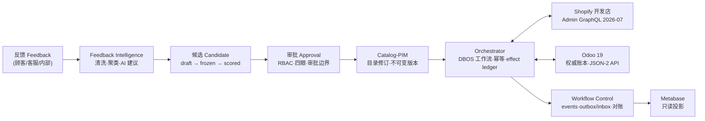

# Commerce Orchestrator — 电商运营控制塔

面向电商组织的**内部运营控制塔（Operations Control Tower）**：把跨系统工作流、候选版本、审批、幂等、effect ledger 与对账，编排在 **Odoo 19（权威账本）** 与 **Shopify 开发店（首个外部渠道）** 之上，通过 Next.js 控制台操作、Metabase 只读投影观测。

> 全仓库文档默认中文；代码、路径、命令与英文 identifier 保持原样。

## 项目定位与职责边界

**做什么**

- 把跨系统业务流编排为可靠、可审计、可回滚的长流程：反馈 → 聚类 → AI 候选 → 审批 → 目录/PIM → 渠道发布 → 效果记账 → 对账闭环。
- 候选版本管理（draft → candidate → frozen → scored → official | rejected → deprecated）与审批控制（RBAC、四眼原则、审批边界、compliance 否决权）。
- 对外部渠道（Shopify）的幂等效果执行，以及 effect ledger 全量记账与每日对账。
- 以 Odoo 19 为权威账本的商品、库存、订单、财务数据集成；Metabase 只读投影运营视图。

**不做什么**

- 不替代 Odoo / Shopify：Odoo 是权威账本，Shopify 是首个渠道，本系统不复制其业务主数据。
- 不做财务核算本身：发票/账单过账仍由 Odoo 与会计完成，已过账发票只能通过贷项通知单修正。
- AI 只生成建议，不批准、不执行任何对外效果。
- 不做动态定价、实时推荐等未在 v1 清单中的能力（见下文“v1 明确不做”）。

## 架构总览



## 技术栈

| 层 | 选型 | 说明 |
|---|---|---|
| 后端 | Python 3.12 / FastAPI / Pydantic / SQLAlchemy 2 / Alembic / uv | API 与 worker 同镜像、不同进程 |
| 长流程引擎 | DBOS OSS + 独立 PostgreSQL | 工作流从最后完成步骤恢复；step 至少一次、事务恰好一次 |
| 渠道集成 | Shopify Admin GraphQL（冻结版本 2026-07）；Odoo 19 External JSON-2 API | 详见 ADR-0007 / ADR-0008 |
| 前端 | Next.js（React） + TypeScript | 运营控制台 |
| 可观测性 | OpenTelemetry / Prometheus / Grafana | correlationId 贯穿 |
| 编排 | Docker Compose | v1 不引入 Redis / RabbitMQ / Kafka / ES / K8s |

依赖快照以 `backend/uv.lock` 为准（fastapi 0.141.1、uvicorn 0.52.1、pydantic 2.13.4、sqlalchemy 2.0.51、alembic 1.19.1、psycopg 3.3.4、structlog 26.1.0、pyjwt 2.13.0、cryptography 49.0.0、uuid6 2025.0.1、OTEL 1.44.x、dbos 2.29）。

## 仓库目录结构

```
commerce-orchestrator/
├── README.md            # 本文件（项目总览）
├── compose.yaml         # Docker Compose 全栈编排
├── Makefile             # 常用命令入口
├── .env.example         # 环境变量样例（不含机密）
├── .github/             # CI 工作流
├── backend/             # Python 后端（FastAPI + DBOS）
│   ├── app/             # 应用代码（api/worker 共用）
│   ├── alembic/         # 数据库迁移
│   ├── tests/           # 测试
│   └── README.md        # 后端开发说明
├── console/             # Next.js 运营控制台
│   └── README.md
├── infra/               # PostgreSQL、监控等基础设施
│   └── README.md
└── docs/                # 文档（中文）
    ├── glossary.md      # 领域术语表
    ├── architecture.md  # 总体架构与信任边界
    ├── development.md   # 开发与契约变更流程
    ├── adr/             # 架构决策记录（0001-0010+）
    ├── runbooks/        # 运维手册（环境/备份/对账）
    └── contracts/       # 契约唯一事实源（API/事件/数据所有权）
```

## 快速开始

**方式一：Docker Compose 全栈（推荐联调/演示）**

```bash
docker compose up -d
```

服务清单、健康检查与数据目录见 [infra/README.md](infra/README.md)。

**方式二：本地开发**

```bash
# 1) 只启动依赖（PostgreSQL 等）
docker compose up -d postgres

# 2) 后端（完整说明见 backend/README.md）
cd backend
uv sync
uv run alembic upgrade head
uv run uvicorn app.main:app --reload

# 3) 控制台（完整说明见 console/README.md）
cd ../console
npm install
npm run dev
```

环境变量：全部来自环境（`backend/.env` 或进程环境），样例见 `.env.example`；真实密钥禁止入库。

## 领域事实所有权

每个领域有唯一事实所有者；跨系统投影必须携带 `sourceRevision` / `observedAt` / `owner`，禁止 last-writer-wins。契约详见 [docs/contracts/data-ownership.md](docs/contracts/data-ownership.md)。

| 领域 | 事实所有者 | 权威事实 | 备注 |
|---|---|---|---|
| Feedback Intelligence | 反馈域 | 结构化反馈、聚类结果、AI 候选建议 | AI 只建议、不批准不执行 |
| Operating Policy | 政策域 | 审批边界、SOP、敏感品类规则 | compliance 维护与否决 |
| Catalog-PIM | 目录域 | 商品内容/上架修订与不可变版本 | 由 catalog_owner 审批 |
| Offer&Pricing | 定价域 | 价格/促销规则 | 调价由 commerce_lead 审批 |
| Shopify | 渠道适配器 | Shopify 侧产品/订单/退款状态 | Admin GraphQL 冻结 2026-07 |
| Odoo Product | Odoo 集成 | 商品主数据（以 Odoo 为准） | External JSON-2 API |
| Inventory | 库存域 | 库存量（仅 stock move/adjustment 改变） | inventory_supervisor 审批 |
| Sales-Purchase | 交易域 | 订单、PO、收货发货 | 四眼原则 |
| Finance | 财务域 | 发票/账单/贷项通知单（Odoo 权威账本） | 过账后只能贷项通知单修正 |
| Workflow Control | 工作流控制 | workflows / events / effect ledger / 幂等记录 | DBOS OSS + PostgreSQL |
| Metabase | 只读投影 | 运营看板（可重建） | 非权威，禁止回写 |

## 核心状态机摘要

- **AI 候选**：`draft → candidate → frozen → scored → official | rejected → deprecated`；冻结后不可修改原候选。
- **Effect**：`planned → dispatched → succeeded | failed | outcome_unknown → reconciled | manual_reconciliation`。
- **工作流**：`accepted → completed | failed | cancelled`。
- **目录修订**：`catalog.revision_drafted → normalized → validated → approved → official → superseded`。

## v1 明确不做

- 不依赖 DBOS Conductor，不做多节点调度；未来需要时评估 Temporal/Hatchet，不自研控制面。
- 不引入 Redis / RabbitMQ / Kafka / Elasticsearch / K8s。
- 不做 last-writer-wins 冲突合并；对账差异禁止自动抹平。
- 仅 Shopify 开发店一个外部渠道。
- Odoo External JSON-2 API 未在真实 Community 容器实测前，不进入写入阶段；不扩大 XML-RPC / `/jsonrpc` 依赖。
- AI 不自动批准或执行任何效果。
- 不做动态定价、实时价格引擎、多渠道聚合。
- 不新增自研队列或自研控制面。

## 验收门禁要点

- **故障测试**：单 effect 重放 10 次无重复副作用；1000 次 kill injection 指标达标；重启恢复 ≤ 5 分钟；30 天人审等待不占用 worker 槽位；差异一律进 `MANUAL_RECONCILIATION`。
- **性能门禁**：p95/p99 与压力测试基准达标（详见 ADR-0010）。
- **首个生产提升条件**：首条纵向切片端到端通过故障注入与对账演练、观察窗口内零未解差异、性能达标、备份恢复与对账 runbook 演练完成、审批边界与四眼原则经合规/财务确认。

## 文档导航

| 文档 | 内容 |
|---|---|
| [docs/glossary.md](docs/glossary.md) | 领域术语表（中文术语 + 英文 identifier） |
| [docs/architecture.md](docs/architecture.md) | 总体架构、信任边界、可靠性模型、首条纵向切片 21 步 |
| [docs/development.md](docs/development.md) | 开发约定、契约变更流程、ADR 流程 |
| [docs/adr/](docs/adr/) | 架构决策记录（0001-0010） |
| [docs/runbooks/](docs/runbooks/) | 运维手册（dev-environment / backup-restore / reconciliation-drift） |
| [docs/contracts/](docs/contracts/) | **契约唯一事实源**（api-contract / event-contract / data-ownership） |
| backend/README.md | 后端开发说明 |
| console/README.md | 控制台开发说明 |
| infra/README.md | 基础设施与 Compose 服务说明 |
