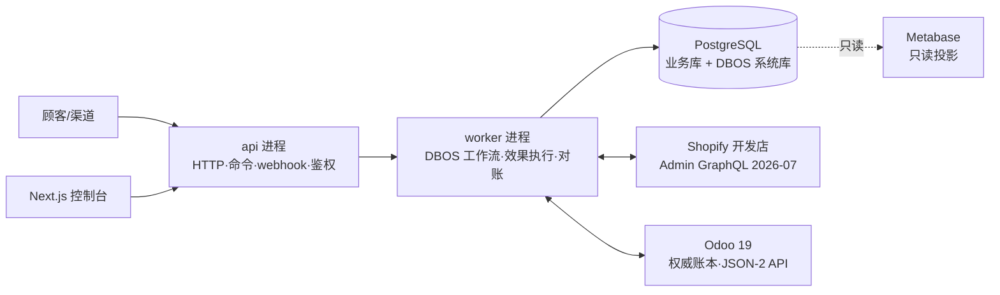
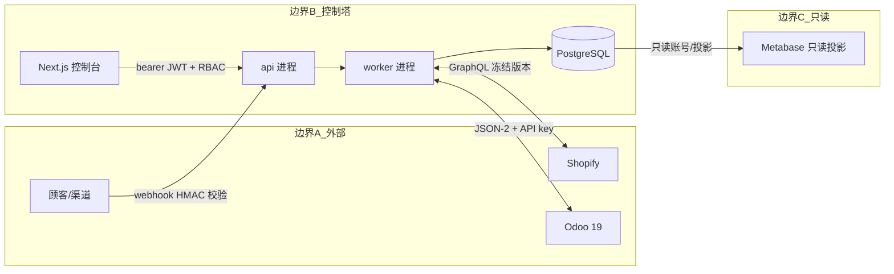

# 总体架构与信任边界

## 1. 目标与非目标

**目标**：把“反馈 → AI 候选 → 审批 → 目录/PIM → 渠道发布 → 效果记账 → 对账”编排为可靠、可审计、可回滚的长流程；以 Odoo 19 为权威账本，Shopify 开发店为首个外部渠道；对运营提供只读投影（Metabase）与控制台（Next.js）。

**非目标**：不替代 Odoo/Shopify；不做财务核算；AI 不批准不执行；v1 单节点、单渠道、无消息队列（见 [docs/adr/0002](adr/0002-technical-stack.md)）。

## 2. 总体架构

## 3. 信任边界

| 边界 | 信任假设 | 控制手段 |
|---|---|---|
| 顾客/渠道 → api | webhook 可能被伪造 | Shopify HMAC-SHA256 常量时间校验 + webhook id 去重 |
| 控制台 → api | 运营人员，需最小权限 | JWT + RBAC（11 类角色）+ 审批边界 + 四眼原则 |
| api → worker | 同一代码库、同库 | 同一镜像不同进程；DBOS 持久化状态 |
| worker → Shopify | 网络不可靠、结果可能未知 | 幂等键、effect ledger、outcome_unknown、增量对账 |
| worker → Odoo | Odoo 为权威账本 | External JSON-2 API、窄方法原子动作、只读投影 |
| PostgreSQL → Metabase | 投影可重建 | 只读账号/投影库，禁止回写 |

## 4. 模块划分：api / worker 同镜像不同进程

同一镜像、两个 entrypoint，共享 `backend/app` 代码与 PostgreSQL：

| 进程 | 入口 | 职责 |
|---|---|---|
| api | `uvicorn app.main:app` | HTTP 命令入口、webhook 接收与校验、JWT/RBAC、幂等记录写入、长命令响应 |
| worker | DBOS worker（`dbos start`/`app.worker:main`） | DBOS 工作流执行、step 调度、渠道适配器（Shopify/Odoo）、effect ledger 执行、outbox 投递、定时对账 |

划分原则：**api 只做入口与校验，不执行外部副作用；worker 只做编排与效果，不暴露公网**。两者通过 PostgreSQL（业务表 + DBOS 系统表）协同，不引入进程间消息通道。

## 5. 可靠性模型

### 5.1 幂等

- 所有内部写命令必须携带 `Idempotency-Key`；服务端保存 `(scope, key, requestHash, result)`。
- 同 key 同 body → 重放存储结果；同 key 不同 body → `409 idempotency_key_conflict`（详见 [api-contract.md](contracts/api-contract.md) 与 ADR-0004）。
- 幂等记录、业务写入与工作流启动在同一恢复单元内提交，避免“记了键但没启动流程”。

### 5.2 outbox / inbox

- 事件统一信封（见 [event-contract.md](contracts/event-contract.md)）；消费者 inbox 唯一键 `(consumer, eventId)` 去重。
- **仅跨数据库边界**使用显式 outbox（如投递 Shopify webhook、Odoo integration outbox）。
- DBOS 事务步骤内不叠加第二套队列真相：工作流状态由 DBOS 持久化，事件表为业务事实，二者同库一致（ADR-0005）。

### 5.3 effect ledger

每个对外效果（如 `shopify.product_publish`、`odoo.sale_order_confirm`）先记 `planned`，执行时 `dispatched`，结果确定后 `succeeded` / `failed`，结果未知则 `outcome_unknown`，经对账后 `reconciled`，需人工处置则 `manual_reconciliation`。效果执行必须携带幂等请求（Idempotency-Key + requestHash），外部调用成功判定需校验全部响应信号（HTTP 状态、顶层 errors、mutation userErrors）。

### 5.4 重试与 outcome_unknown

- DBOS 语义：step 至少一次（at-least-once）、事务步骤恰好一次（exactly-once）、工作流从最后完成的步骤恢复。
- 外部调用在有限次重试后仍无法确认结果 → 标记 `outcome_unknown`，进入对账路径；**不盲目重复派发**可能已生效的效果。
- 30 天人工审批等待不占用 worker 槽位（挂起不阻塞其他工作流）。

### 5.5 对账

- 每日定时对账（建议每日 03:00，可配置）：按 Shopify `updated_at` 增量拉取，与 effect ledger 和 Odoo 状态比对。
- 差异一律进入 `MANUAL_RECONCILIATION`，**禁止自动抹平**；人工处置后重新对账清零，`effect.reconciled`，关联工作流 `closed`（见 [runbooks/reconciliation-drift.md](runbooks/reconciliation-drift.md)）。

## 6. 隐私与可观测性

### 6.1 最小字段与加密保留

- 最小字段原则：只采集业务必需字段；结构化反馈经 sanitizer 脱敏后入库。
- 原始 webhook/反馈 payload 加密存储（如 AES-GCM，密钥来自环境 `ENCRYPTION_KEY`），**保留 30 天后自动清除**。
- 机密（API key、webhook secret、加密密钥）只存在于环境变量与 `.env`（被 gitignore），禁止入库。

### 6.2 correlationId 追踪

- 每个入口分配 `correlationId`，随事件信封 `correlationId`/`causationId` 贯穿全链路；日志、指标、事件均携带，用于审计与排障。

### 6.3 OTel / Prometheus / Grafana

- OpenTelemetry（OTLP over HTTP）导出 trace；`prometheus-client` 暴露指标（工作流状态、effect 延迟、对账差异数、幂等冲突数等）。
- Grafana 提供运营与可靠性看板；采集范围与保留策略见 `infra/`。

## 7. 首条纵向切片（21 步）

“一条顾客反馈 → 发布到 Shopify → 对账闭环”的端到端最小切片，同时打通 effect ledger 与 Metabase 投影。

```mermaid
flowchart TD
    S1["1 接收反馈<br/>POST /v1/feedback 校验最小字段"] --> S2["2 原始 payload 加密存 30 天<br/>脱敏写入·feedback.observed"]
    S2 --> S3["3 启动聚类工作流<br/>feedback_clustering"]
    S3 --> S4["4 聚类完成<br/>feedback.clustered·生成候选需求"]
    S4 --> S5["5 AI 生成候选<br/>draft→candidate·保存证据元数据"]
    S5 --> S6["6 候选冻结<br/>candidate→frozen→scored·不可修改"]
    S6 --> S7["7 按审批边界路由<br/>创建 work item·expectedWorkflowVersion"]
    S7 --> S8["8 审核人查看证据并决策<br/>POST /v1/work-items/{id}/decisions"]
    S8 --> S9["9 决策落库<br/>feedback.promoted | rejected"]
    S9 --> S10["10 转交 Catalog-PIM<br/>catalog.revision_drafted"]
    S10 --> S11["11 规范化与校验<br/>normalized → validated·核对 Odoo 主数据"]
    S11 --> S12["12 catalog_owner 审批<br/>catalog.approved·compliance 可否决"]
    S12 --> S13["13 修订成为 official<br/>catalog.official·旧版 superseded"]
    S13 --> S14["14 创建上架计划<br/>listing.publishing"]
    S14 --> S15["15 记 effect.planned<br/>生成 Idempotency-Key + requestHash"]
    S15 --> S16["16 Shopify GraphQL 2026-07 执行<br/>effect.dispatched"]
    S16 --> S17["17 校验 HTTP/errors/userErrors<br/>listing.published·effect.succeeded"]
    S17 --> S18["18 失败或超时<br/>effect.outcome_unknown·有限重试不盲发"]
    S18 --> S19["19 每日增量对账<br/>updated_at 比对·差异进 MANUAL_RECONCILIATION"]
    S19 --> S20["20 人工处置并复核<br/>effect.reconciled·workflow.completed"]
    S20 --> S21["21 Metabase 只读投影更新<br/>correlationId 全程可追溯"]
```

1. 顾客在渠道/客服提交反馈；`POST /v1/feedback` 接收并校验最小字段，分配 `eventId`/`correlationId`。
2. 原始 payload 加密落库（保留 30 天）；脱敏后的结构化反馈写入，发出 `feedback.observed`。
3. 启动聚类工作流 `feedback_clustering`，按相似度与证据位置聚类。
4. 聚类完成，发出 `feedback.clustered`，识别可行动主题并生成候选需求。
5. AI 建议引擎生成候选（draft → candidate），保存 `sourceRefs`/`sourceRevision`/`sanitizerVersion`/`modelId`/`promptVersion`/`ruleVersion`/`proposalHash`。
6. 候选冻结（frozen）并评分（scored）：冻结后原候选不可修改，生成证据视图。
7. 按审批边界路由审批任务（商品内容/上架 → `catalog_owner`），work item 携带 `expectedWorkflowVersion`。
8. 审核人在 console 查看证据位置，做 approve/reject 决策；决策命令携带版本号防过期。
9. 决策落库：`feedback.promoted` / `feedback.rejected`；被否决候选进入 rejected → deprecated。
10. promoted 候选转交 Catalog-PIM：创建目录修订（`catalog.revision_drafted`）。
11. 修订规范化与校验（normalized → validated）：与 Odoo 商品主数据核对、满足目录约束。
12. `catalog_owner` 审批修订（`catalog.approved`）；compliance 可否决上架/SOP/敏感品类。
13. 修订成为 official（`catalog.official`），旧版本标记 superseded，形成不可变发布基线。
14. listing 域创建上架计划（`listing.publishing`），确定 Shopify 渠道与发布参数。
15. orchestrator 将 effect 记入 effect ledger（`effect.planned`），生成幂等请求。
16. 渠道适配器通过 Shopify Admin GraphQL（2026-07 冻结版本）执行发布（`effect.dispatched`）。
17. 校验响应：HTTP 状态 + 顶层 errors + mutation userErrors 三处全部通过才算成功 → `listing.published`、`effect.succeeded`。
18. 失败或超时 → `effect.outcome_unknown`：有限重试；仍未知则等待对账，不盲目重发。
19. 每日对账任务按 Shopify `updated_at` 增量拉取，与 effect ledger/Odoo 比对；差异写入 `MANUAL_RECONCILIATION`（禁止自动抹平）。
20. 人工处置差异并复核 → `effect.reconciled`；工作流发出 `workflow.completed`。
21. Metabase 只读投影消费事件更新运营视图；全程可按 `correlationId`/`causationId` 追溯审计。

## 8. 部署形态

- v1：单节点 Docker Compose（api + worker + PostgreSQL + console + Metabase），满足 OSS 单节点自动恢复模型。
- 多节点调度与 HA 不在 v1；需要时按 ADR-0001 评估 Temporal/Hatchet，不自研控制面。
