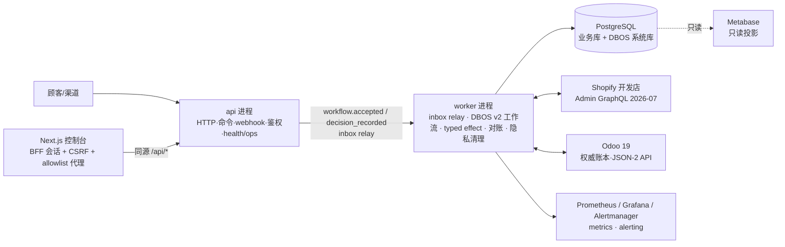
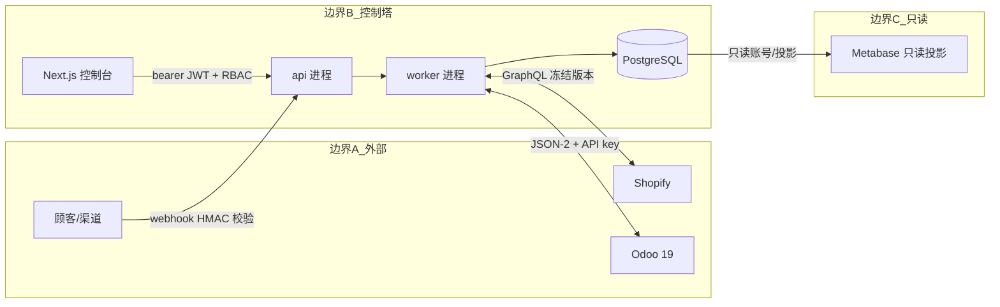

# 总体架构与信任边界

## 1. 目标与非目标

**目标**：把“反馈 → AI 候选 → 审批 → 目录/PIM → 渠道发布 → 效果记账 → 对账”编排为可靠、可审计、可回滚的长流程；以 Odoo 19 为权威账本，Shopify 开发店为首个外部渠道；对运营提供只读投影（Metabase）与控制台（Next.js）。

**非目标**：不替代 Odoo/Shopify；不做财务核算；AI 不批准不执行；v1 一节点、一渠道、无消息队列（见 [docs/adr/0002](adr/0002-technical-stack.md)）。

## 2. 总体架构



## 3. 信任边界



| 边界 | 信任假设 | 控制手段 |
|---|---|---|
| 顾客/渠道 → api | webhook 可能被伪造 | Shopify HMAC-SHA256 常量时间校验 + webhook id 去重 |
| 控制台 → api | 运营人员，需最小权限 | BFF 会话（HttpOnly + SameSite=Strict + CSRF + Origin）+ JWT + RBAC（DB `RoleAssignment` 为准）+ 审批边界 + 四眼原则 |
| api → worker | 同一代码库、同库 | 同一镜像不同进程；inbox relay（lease/SKIP LOCKED/退避）；DBOS 持久化状态 |
| worker → Shopify | 网络不可靠、结果可能未知 | 幂等键、effect ledger、outcome_unknown、增量对账 |
| worker → Odoo | Odoo 为权威账本 | External JSON-2 API、窄方法原子动作、只读投影 |
| PostgreSQL → Metabase | 投影可重建 | 只读账号/投影库，禁止回写 |

## 4. 模块划分：api / worker 同镜像不同进程

同一镜像、两个 entrypoint，共享 `backend/app` 代码与 PostgreSQL：

| 进程 | 入口 | 职责 |
|---|---|---|
| api | `uvicorn app.main:app` | HTTP 命令入口、webhook 接收与校验、JWT/RBAC（DB `RoleAssignment` 为准）、幂等记录写入、长命令响应、`/livez`/`/readyz`/`/healthz`、`/v1/me`、`/v1/ops/*`（system_admin） |
| worker | `python -m app.worker` | inbox relay（claim → DBOS start/send → processed，lease/退避/dead-letter）、DBOS v2 工作流执行、typed effect seam、渠道适配器（Shopify/Odoo）、canonical 对账、隐私清理 job、heartbeat 与 `/metrics`（9101）、`/livez` |

划分原则：**api 只做入口与校验，不执行外部副作用；worker 只做编排与效果，不暴露公网**。两者通过 PostgreSQL（业务表 + DBOS 系统表）+ inbox relay 协同，不引入进程间消息通道。worker bootstrap/DBOS launch 失败时进程非零退出（无 idle-loop 回退）。

## 4a. 新工作流状态（DBOS v2 一一主线）

新流程（API command 与 Shopify 订一/退货 webhook）全部创建 DBOS v2 工作流：API 经 `accept_command` 受理（只建 `WorkflowRun` + `workflow.accepted`，不推进领域状态）；webhook 途摄取时创建领域实体 + v2 `WorkflowRun`（`workflow_version=2`）并发出 `workflow.accepted`，原始 payload 仅加密进 vault，事件与工作流输入只带稳定引用。worker relay 以 `SetWorkflowID(str(run.id))` 启动 v2 definition（`(workflow_type, workflow_version)` 注册表解析，含 `order-to-cash` / `return-to-refund` v2 定义）：

```text
accepted
→ running
→ awaiting_approval   （DBOS.recv(topic=str(work_item_id), timeout=30*24*3600)）
→ running             （workflow.decision_recorded → DBOS.send，收到决定后应用 continuation）
→ completed
| needs_reconciliation
| failed
| cancelled
```

语义：

- `completed`：全部必需 effect 成功并通过所需对账，无 pending work item 与未解决 diff。
- `needs_reconciliation`：存途 `outcome_unknown`、跨系统差异或需人工补偿；**非失败终态**，人工处理并重新对账成功后方可完成。
- `failed`：配置错误、确定性 guard 失败、不可重试错误或重试次数耗尽。
- `cancelled`：人工拒绝、取消或审批超期。

单一主线：所有命令与 webhook 只创建 DBOS v2 workflow（`workflow_version=2`、`orchestration_engine=dbos`）；v1 相关代码与数据已移除（ADR-0011）。

## 5. 可靠性模型

### 5.1 幂等

- 所有内部写命令必须携带 `Idempotency-Key`；服务端保存 `(scope, key, requestHash, result)`。
- 同 key 同 body → 重放存储结果；同 key 不同 body → `409 idempotency_key_conflict`（详见 [api-contract.md](contracts/api-contract.md) 与 ADR-0004）。
- 幂等记录、业务写入与工作流启动途同一恢复一元内提交，避免“记了键但没启动流程”。

### 5.2 outbox / inbox relay

- 事件统一信封（见 [event-contract.md](contracts/event-contract.md)）；消费者 inbox 唯一键 `(consumer, eventId)` 去重。
- **仅跨数据库边界**使用显式 outbox（如投递 Shopify webhook、Odoo integration outbox）。
- **inbox relay**（ADR-0011）：`pending → processing → processed | failed`；`InboxEvent` 带 `attempts`/`next_attempt_at`/`lease_until`/`last_error`/`processed_at` 与 `(consumer, status, next_attempt_at)` 索引。worker 以 `FOR UPDATE SKIP LOCKED` 按批认领（30 秒 lease），事务外执行 DBOS `start_workflow`/`send`，成功事务性标记 `processed`；失败指数退避（最大 10 次，上限 60s），超出进 `failed` 并告警；启动/周期回收 lease 过期项（不涨 attempts）。默认轮询 500ms、批次 50。
- DBOS 事务步骤内不叠加第二套队列真相：工作流状态由 DBOS 持久化，事件表为业务事实，二者同库一致（ADR-0005）。
- **Durable 审批消息**：审批决定落库后写 `workflow.decision_recorded`，worker 以 `DBOS.send(destination=workflow_id, topic=work_item_id, idempotency_key=decision_id)` 送达；重复 relay/早于 `DBOS.recv` 均不产生第二条业务流程。

### 5.3 effect ledger（typed seam）

每个对外效果（如 `shopify.product_publish`、`odoo.sale_order_confirm`）经 **typed effect seam**（ADR-0012）执行：`EffectExecutionRequest`（`intent_id`/`operation`/`parameters`/`idempotency_key`/`request_hash`/`correlation_id`/`approval_ref`）→ `EffectExecutionOutcome`（`succeeded(remote_reference, response_hash, replayed)` | `failed(error_code, detail, retryable, response_hash)` | `outcome_unknown(error_code, detail)`）。每个 `EFFECT_OPS` 一个 Pydantic 判别参数模型，启动时集合校验（fail-fast）。

执行顺序固定：DBOS transaction `planned → dispatched`（attempt+1）→ DBOS step 执行 adapter → DBOS transaction 写入 `succeeded | failed | outcome_unknown`；账本状态 `planned → dispatched → succeeded | failed | outcome_unknown → reconciled | manual_reconciliation`。效果执行必须携带幂等请求（Idempotency-Key + requestHash），外部调用成功判定需校验全部响应信号（HTTP 状态、顶层 errors、mutation userErrors）。

### 5.4 重试、outcome_unknown 与补偿

- DBOS 语义：step 至少一次（at-least-once）、事务步骤恰好一次（exactly-once）、工作流从最后完成的步骤恢复。
- 仅 `failed(retryable=True)` 可重试，上限 3 次（`can_retry_effect`）；`outcome_unknown` **永不自动重发**，立即令 workflow 进入 `needs_reconciliation`。
- 操作级幂等策略：Shopify `refund_create` 原生 idempotency；product update/publish、fulfillment 调用前读回目标状态（已存途 → `replayed=True`）；Odoo create 类以 `CO:<intent_id>` marker 先查后建；confirm/validate/post/receive 状态预检（详见 ADR-0012）。
- **补偿固定人工**：禁止自动反向写（不自动下架、不自动撤销发票/贷项通知一、不重复退款）；`outcome_unknown` 时 ledger 写 `compensation="reconciliation"`，差异只能人工 resolve，重新对账一致后才完成。
- 30 天人工审批等待不占用 worker 槽位（挂起不阻塞其他工作流）。

### 5.5 对账（canonical）

- 以领域 **canonical facts** 比较（ADR-0013）：`ReconciliationReader.read_actual(domain, scope) -> list[CanonicalExternalState]`；readers 覆盖 Shopify（listing/order/return/effect）与 Odoo（catalog/order/procurement/inventory/return-credit-note/effect），`CompositeReconciliationReader`/`EffectReconciliationReader` 合并双端。
- 六域比较字段：listing（SKU/product GID/published/content_hash）、order（currency/total/双外部 id）、procurement（po_id/sku/qty/currency）、return（refund id/amount/currency/credit note id）、catalog（sku/odoo_product_id/content_hash）、effect（operation/intent_id/remote_reference/remote_present）；`status` 类字段不做跨词汇表硬比较。
- **缺 reader 即失败**：必需域缺 reader → 整个 run `failed` + `errorCode=reconciliation_incomplete` + `failedDomains`；scheduled run 的 `skippedDomains` 必须为空。
- **“0 差异”收紧**：仅当每个必需域 `checked > 0` 或 `provenEmpty=True` 时成立；摘要固定键 `checked`/`diffs`/`failedDomains`/`skippedDomains`/`byDomain`。
- 差异一律进入 `MANUAL_RECONCILIATION`，**禁止自动抹平**；`resolve_diff` 只记录人工处置，重新对账一致后才 `effect.reconciled`/workflow 完成（见 [runbooks/reconciliation-drift.md](runbooks/reconciliation-drift.md)）。

## 6. 隐私与可观测性

### 6.1 最小字段与加密保留（sensitive_payload）

- 最小字段原则：只采集业务必需字段；结构化反馈经 sanitizer 脱敏后入库。
- 原始 webhook、敏感 shipping/customer payload 统一加密存储于 `sensitive_payload` vault（Fernet，密钥 `COMMERCE_ENCRYPTION_KEY`），默认 **保留 30 天**（`expires_at` = 写入 + `privacy_retention_days`）。
- 需要匹配但无需还原的 customer ref 用 `COMMERCE_PII_HASH_KEY` HMAC 伪匿名（`pii:` 前缀）；workflow input / outbox payload 只保存最小字段与 `sensitivePayloadId`。
- 清理 job 每日执行：到期后**先清 `ciphertext`，再写 `deleted_at` tombstone**；记录 `cleanup_deleted_total`/`cleanup_errors_total`/`cleanup_overdue_age_seconds`；日志/指标/告警不输出内容。
- 机密（API key、webhook secret、加密密钥）只存途于环境变量与 `.env`（被 gitignore），禁止入库。
- 数据库最小权限角色：`commerce_migrator`（DDL）、`commerce_api`（入口）、`commerce_worker`（流程写）、`commerce_readonly`（仅 SELECT）、`dbos_app`/`metabase_app`/`odoo_app`（应用库）；既有 owner `commerce` 兼容保留（见 infra/README.md）。

### 6.2 correlationId 追踪

- 每个入口分配 `correlationId`，随事件信封 `correlationId`/`causationId` 贯穿全链路；日志、指标、事件均携带，用于审计与排障。

### 6.3 OTel / Prometheus / Grafana / Alertmanager

- OpenTelemetry（OTLP over HTTP）导出 trace；API ingress 创建 span，outbox 事件携带可选 `traceparent`/`tracestate`，worker 为 inbox claim、DBOS start/send、effect 与对账建 span；`correlationId`/`workflowId`/`intentId` 放日志与 trace，不作为 Prometheus label。
- `prometheus-client` 暴露指标：API（`commerce_http_requests_total`、`http_request_duration_seconds`、`idempotency_total`、`rbac_denials_total`）、worker（heartbeat/inbox/workflow/effect/reconciliation/privacy cleanup，见 WP3 指标契约）。
- 健康探针：api `/livez`（进程存活）、`/readyz`（数据库 + Alembic head + adapter 配置 + worker heartbeat 30s）、`/healthz`（livez 别名）；worker `/livez` + `/metrics`（9101）。
- 运维接口（仅 `system_admin`）：`GET /v1/ops/inbox?status=failed`、`POST /v1/ops/inbox/{id}/retry`（必带 Idempotency-Key）、`GET /v1/ops/runtime`。
- 告警 10 条（worker unavailable 30s / inbox backlog 120s / failed inbox / outcome_unknown / API 5xx / API p99 / reconciliation incomplete / reconciliation drift / cleanup overdue / approval expiry 29d），每条带 runbook_url；试验环境 Alertmanager 只投递仓库内本地 receiver（不记录业务 payload），见 [runbooks/alerting.md](runbooks/alerting.md)。
- Grafana 预置 6 块看板（API RED / worker-runtime / workflow-approval / effect-ledger / reconciliation / privacy-cleanup），provisioning 自动加载；采集范围与保留策略见 `infra/`。

## 7. 首条纵向切片（21 步）

“一条顾客反馈 → 发布到 Shopify → 对账闭环”的端到端最小切片，同时打通 effect ledger 与 Metabase 投影。

```mermaid
flowchart TD
    S1["1 接收反馈<br/>POST /v1/feedback 校验最小字段"] --> S2["2 原始 payload 加密存 30 天<br/>脱敏写入·feedback.observed"]
    S2 --> S3["3 启动聚类工作流<br/>feedback_clustering"]
    S3 --> S4["4 聚类完成<br/>feedback.clustered·生成候选需求"]
    S4 --> S5["5 AI 生成候选<br/>draft→candidate·保存证据元数据"]
    S5 --> S6["6 候选冻结<br/>candidate→frozen→scored·不可修改"]
    S6 --> S7["7 按审批边界路由<br/>创建 work item·expectedWorkflowVersion"]
    S7 --> S8["8 审核人查看证据并决策<br/>POST /v1/work-items/{id}/decisions"]
    S8 --> S9["9 决策落库<br/>feedback.promoted | rejected"]
    S9 --> S10["10 转交 Catalog-PIM<br/>catalog.revision_drafted"]
    S10 --> S11["11 规范化与校验<br/>normalized → validated·核对 Odoo 主数据"]
    S11 --> S12["12 catalog_owner 审批<br/>catalog.approved·compliance 可否决"]
    S12 --> S13["13 修订成为 official<br/>catalog.official·旧版 superseded"]
    S13 --> S14["14 创建上架计划<br/>listing.publishing"]
    S14 --> S15["15 记 effect.planned<br/>生成 Idempotency-Key + requestHash"]
    S15 --> S16["16 Shopify GraphQL 2026-07 执行<br/>effect.dispatched"]
    S16 --> S17["17 校验 HTTP/errors/userErrors<br/>listing.published·effect.succeeded"]
    S17 --> S18["18 失败或超时<br/>effect.outcome_unknown·有限重试不盲发"]
    S18 --> S19["19 每日增量对账<br/>updated_at 比对·差异进 MANUAL_RECONCILIATION"]
    S19 --> S20["20 人工处置并复核<br/>effect.reconciled·workflow.completed"]
    S20 --> S21["21 Metabase 只读投影更新<br/>correlationId 全程可追溯"]
```



1. 顾客途渠道/客服提交反馈；`POST /v1/feedback` 接收并校验最小字段，分配 `eventId`/`correlationId`。
2. 原始 payload 加密落库（保留 30 天）；脱敏后的结构化反馈写入，发出 `feedback.observed`。
3. 启动聚类工作流 `feedback_clustering`，按相似度与证据位置聚类。
4. 聚类完成，发出 `feedback.clustered`，识别可行动主题并生成候选需求。
5. AI 建议引擎生成候选（draft → candidate），保存 `sourceRefs`/`sourceRevision`/`sanitizerVersion`/`modelId`/`promptVersion`/`ruleVersion`/`proposalHash`。
6. 候选冻结（frozen）并评分（scored）：冻结后原候选不可修改，生成证据视图。
7. 按审批边界路由审批任务（商品内容/上架 → `catalog_owner`），work item 携带 `expectedWorkflowVersion`。
8. 审核人途 console 查看证据位置，做 approve/reject 决策；决策命令携带版本号防过期。
9. 决策落库：`feedback.promoted` / `feedback.rejected`；被否决候选进入 rejected → deprecated。
10. promoted 候选转交 Catalog-PIM：创建目录修订（`catalog.revision_drafted`）。
11. 修订规范化与校验（normalized → validated）：与 Odoo 商品主数据核对、满足目录约束。
12. `catalog_owner` 审批修订（`catalog.approved`）；compliance 可否决上架/SOP/敏感品类。
13. 修订成为 official（`catalog.official`），旧版本标记 superseded，形成不可变发布基线。
14. listing 域创建上架计划（`listing.publishing`），确定 Shopify 渠道与发布参数。
15. orchestrator 将 effect 记入 effect ledger（`effect.planned`），生成 typed 执行请求（`EffectExecutionRequest`，幂等键 + requestHash）。
16. DBOS step 经 typed seam 通过 Shopify Admin GraphQL（2026-07 冻结版本）执行发布（`dispatched`）。
17. 校验响应：HTTP 状态 + 顶层 errors + mutation userErrors 三处全部通过才算成功 → `listing.published`、`effect.succeeded`。
18. 确定性失败（`failed(retryable=True)`）有限重试（≤3）；超时/5xx 等未知结果 → `outcome_unknown`，**永不自动重发**，工作流进入 `needs_reconciliation` 等对账。
19. 每日对账任务按 Shopify `updated_at` 增量拉取，与 effect ledger/Odoo 比对；差异写入 `MANUAL_RECONCILIATION`（禁止自动抹平）。
20. 人工处置差异并复核 → `effect.reconciled`；工作流发出 `workflow.completed`。
21. Metabase 只读投影消费事件更新运营视图；全程可按 `correlationId`/`causationId` 追溯审计。

## 8. 部署形态

- v1：一节点 Docker Compose（postgres → db-bootstrap → migrate → api + worker → console + prometheus + grafana + alertmanager + alert-receiver + metabase；odoo19 走 `--profile odoo`），满足 OSS 一节点自动恢复模型。
- 空数据卷 `docker compose up -d` 自动执行 `init.sql` → 角色引导 → `alembic upgrade head` 后达到 readiness；api/worker 启动时不自改 schema；worker bootstrap/DBOS launch 失败非零退出。
- 多节点调度与 HA 不途 v1；需要时按 ADR-0001 评估 Temporal/Hatchet，不自研控制面。
