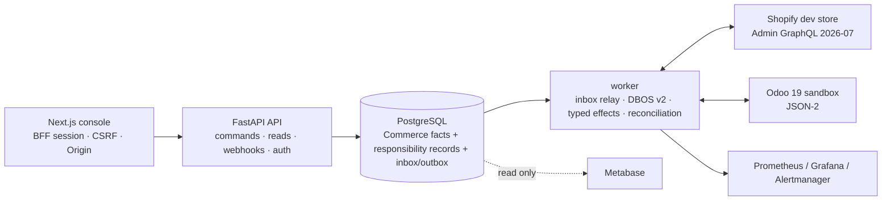
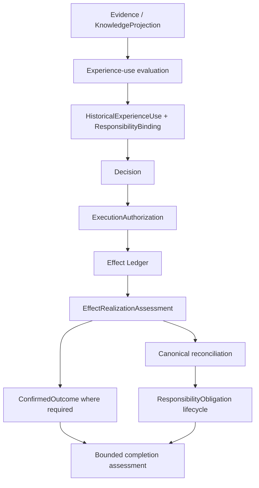

# 总体架构与信任边界

## 1. 目标与非目标

目标：把跨系统 commerce 操作组织成 durable、auditable、reconcilable 的长流程，并在执行前后保留明确的 Decision、execution authority、effect、reality verification、reconciliation 与 bounded completion 语义。

当前运行形态是个人 sandbox：模拟数据 + Shopify development store + Odoo 19 sandbox。没有真实用户、真实订单或 production-promotion path（ADR-0015）。

非目标：

- 不替代 Shopify/Odoo；
- 不在 Commerce Orchestrator 内做 Odoo 应承担的财务核算；
- AI 不批准、不 mint authority、不执行外部 effect；
- 不把 `succeeded`、`resolved`、`completed` 等局部事实升级成更强的 universal claim；
- 不自研第二套 durable workflow/control-plane queue；DBOS 仍是 workflow substrate。

## 2. Runtime topology



API 与 worker 使用同一 backend codebase，但职责分离：

| 进程 | 入口 | 职责 |
| --- | --- | --- |
| API | `uvicorn app.main:app` | command/webhook ingress、JWT/RBAC、Idempotency-Key、read API、responsibility record requests、health/metrics |
| worker | `python -m app.worker` | inbox relay、DBOS workflow、typed effect dispatch、external read-back/reconciliation、privacy cleanup、heartbeat/metrics |

原则：API request 不直接执行 Shopify/Odoo 外部副作用；worker 才是 durable execution side。

## 3. Trust boundaries

| Boundary | Risk | Control |
| --- | --- | --- |
| Browser/console → API | token exposure / client authority inference | same-origin BFF HttpOnly session、CSRF、Origin、server RBAC；console non-authoritative |
| External webhook → API | forged/replayed webhook | Shopify HMAC verification + webhook id dedup + encrypted raw payload vault |
| API → worker | duplicate/early messages | PostgreSQL inbox relay + DBOS start/send idempotency |
| worker → Shopify/Odoo | timeout/unknown result/duplicate side effect | typed effect seam + idempotency + effect ledger + read-back + reconciliation |
| responsibility explanation → dispatch | explanation/enforcement drift | listing current explanation is shared with dispatch eligibility composition |
| PostgreSQL → Metabase | projection mistaken for authority | read-only projection; no write-back |

## 4. Durable workflow mainline

所有新 command/webhook flow 使用 DBOS v2：

```text
accept command/webhook
  -> create WorkflowRun
  -> workflow.accepted
  -> inbox relay
  -> DBOS workflow
  -> work item / DBOS.recv when human decision required
  -> workflow.decision_recorded / DBOS.send
  -> effect plan + dispatch
  -> external read-back / realization verification
  -> canonical reconciliation
  -> bounded completion assessment
```

Workflow state：

```text
accepted
  -> running
  -> awaiting_approval
  -> running
  -> completed | needs_reconciliation | failed | cancelled
```

`needs_reconciliation` 是非失败、非完成的中间恢复状态。`outcome_unknown` 不进入自动 resend。

## 5. Decision / Authorization boundary

`WorkItemDecision` 与 `ExecutionAuthorization` 是不同事实。

普通决定：

```text
POST /v1/work-items/{id}/decisions
```

需要执行 authority 的 approve：

```text
POST /v1/work-items/{id}/authorized-decisions
```

server-owned profiles：

| Profile | Target | Operations |
| --- | --- | --- |
| `listing-publication-v1` | Shopify | `shopify.product_publish` |
| `return-credit-note-v1` | Odoo | `odoo.credit_note_create`, `odoo.credit_note_validate` |
| `return-refund-v1` | Shopify | `shopify.refund_create` |

Authorized decision endpoint 在同一事务内记录 Decision 并 mint 独立 authorization。普通 decision endpoint 对需要 profile 的 `approve` fail closed。

Authorization 绑定：

- workflow ref；
- subject type/ref/version/fingerprint；
- target system；
- allowed operation set；
- policy version；
- environment ref；
- issuer；
- optional expiry/revocation。

Dispatch 必须 exact-match 当前事实；角色、历史 approval、前端 scope 不能被推断成 authority。

## 6. Responsibility plane



核心不等价关系：

```text
candidate != Decision
ExperienceUseAdmission.allowed != Decision
Decision != ExecutionAuthorization
PublicationQualification.qualified != Authorization
EffectLedger.succeeded != ConfirmedOutcome
reconciliation disposition != verified repair
WorkflowRun.completed != universal responsibility discharge
```

完整 contract：`docs/contracts/responsibility-alignment.md`。

## 7. CURRENT vs HISTORICAL

`GET /v1/workflows/{workflow_id}/responsibility` 返回 non-authority-bearing inspector projection。

对于 listing publication：

- `historical`：记录过去 judgment 实际依赖的 Experience snapshot；
- `currentResponsibility`：按当前 authorization、publication qualification、Experience-use 状态与 applicable open obligations 重新计算；
- CURRENT 不改写 HISTORICAL；HISTORICAL 也不能直接证明 CURRENT eligible。

`explain_listing_current_responsibility()` 同时被 current inspector 和 publication dispatch eligibility 使用，因此 UI explanation 与实际 dispatch gate 共用核心 server logic。

Responsibility obligation discharge 只改变当前 open 状态，不删除历史记录。

## 8. Typed effect + reality verification

External side effect 统一走 typed effect seam：

```text
EffectExecutionRequest
  -> effect.planned
  -> effect.dispatched
  -> succeeded | failed | outcome_unknown
```

`outcome_unknown`：不自动 resend，进入 reconciliation。

`effect.succeeded` 只是 adapter/execution report。真实世界结果通过 `EffectRealizationAssessment` 显式验证；`ConfirmedOutcome` 仅允许从同一 effect 的 `VERIFIED` assessment + evidence 建立。

因此：

```text
execution fact -> reality evidence -> confirmed bounded outcome
```

三者不能合并成一个布尔值。

## 9. Canonical reconciliation

支持六个 canonical domains：

`listing` · `order` · `procurement` · `return` · `catalog` · `effect`

规则：

- required reader 缺失 => run failure；
- scheduled run 不允许把 skipped domain 当 success；
- “0 diff”要求 domain 已 checked 或 explicit proven-empty；
- diff 不自动抹平；
- manual resolve 记录 disposition，但不自动证明 external repair；
- 后续 read-back/reconciliation 才能证明一致。

## 10. Bounded completion

`backend/app/services/workflow_completion.py` 定义当前 per-workflow completion contracts。

可能要求：

- pending work items 已 settled；
- domain terminal state；
- current publication qualification；
- required effect classes 存在；
- run-owned effects 的 realization verified；
- profile 要求时存在 ConfirmedOutcome；
- 无 blocking reconciliation diff。

coverage claim 永久是：

```text
declared-scope-only
```

如果 workflow 已进入 blocked completion wait，可通过：

```text
POST /v1/workflows/{workflow_id}/completion-recheck
```

发出 `workflow.completion_recheck_requested` durable signal。该操作不制造 evidence、不直接 complete，只要求 waiting workflow 重新评估 current facts。

## 11. Persistence / migrations

Commerce application schema 由 Alembic 管理。当前 migration chain 已到：

```text
0010_responsibility_workflow_refs.py
```

近期 schema additions 包括：

- publication qualification；
- effect realization；
- reconciliation resolution；
- responsibility records / authorization / outcome / obligation；
- responsibility workflow references。

因此旧文档中“0001 creates all tables”或固定旧 table count 均不再成立。

## 12. Privacy / observability

- raw webhook/sensitive payload 使用 Fernet vault；
- customer ref 在无需还原场景使用 HMAC pseudonymization；
- logs/traces/metrics 不记录明文 token/PII；
- API readiness 检查 DB、Alembic head、Shopify/Odoo adapter config、worker heartbeat；
- worker/API 暴露 metrics，Grafana/Prometheus/Alertmanager 负责试验环境 observability。

## 13. Console boundary

Next.js console 使用 same-origin BFF secure session，JWT 不写 `localStorage`。

Console 可以：

- 浏览 workflow/work item/reconciliation/ops；
- 提交 decision；
- 对 server-projected authorization profile 使用 authorized decision endpoint；
- 浏览 Responsibility Inspector。

Console 不可以：

- 根据 `allowedOperations`、scope、projection refs 或 portable status 自行 mint/infer authority；
- 把历史记录当作当前 eligibility；
- 把 `succeeded` 展示成已确认 business outcome，除非 server 已提供对应事实。

## 14. Documentation hierarchy

- 当前实现快照：`docs/current-implementation.md`
- 本架构文档：runtime/trust/execution model
- responsibility layering：`docs/architecture/responsibility-layering.md`
- normative contracts：`docs/contracts/`
- historical decisions：`docs/adr/`
- operator procedures：`docs/runbooks/`
