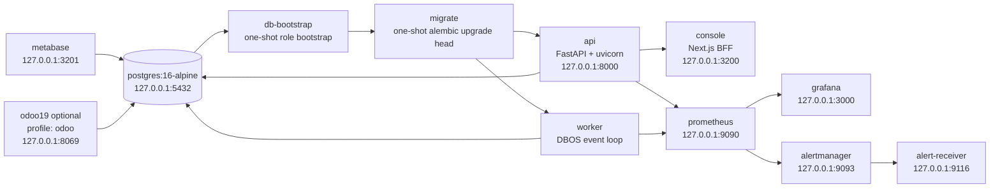

# infra — Deployment & operations

This directory carries commerce-orchestrator's containerized deployment, database initialization, and observability stack:

```
infra/
├── README.md                    # this file: topology, start/stop, environment variables, FAQ
├── postgres/
│   ├── init.sql                 # Postgres first-time init (DBOS/metabase/odoo databases + pgcrypto)
│   └── bootstrap.sql            # idempotent role/permission bootstrap (run by the db-bootstrap service)
├── prometheus/
│   ├── prometheus.yml           # scrapes api/worker /metrics (container network)
│   └── rules/alerts.yml         # P7 ten alert-rule classes (each with runbook_url)
├── grafana/
│   ├── provisioning/            # provisioned datasource (Prometheus) and dashboard provider
│   └── dashboards/              # provisioned 6 dashboards (API RED / worker-runtime /
│                                #   workflow-approval / effect-ledger /
│                                #   reconciliation / privacy-cleanup)
├── alertmanager/
│   └── alertmanager.yml         # shadow environment delivers only to the local alert-receiver
├── alert-receiver/              # local alert receiver (records name/level/runbook URL)
└── scripts/                     # deployment/ops helper scripts
```

## Deployment topology (P7)



### Start order

```text
postgres healthy → db-bootstrap completed → migrate completed
→ api + worker (in parallel) → api/worker ready
→ console + prometheus + grafana + alertmanager + alert-receiver + metabase
```

- **postgres**: `postgres:16-alpine`, runs `init.sql` on first empty volume (creates dbos/metabase/odoo databases, enables pgcrypto), health check `pg_isready`.
- **db-bootstrap**: one-shot service, idempotently runs `bootstrap.sql` — creates least-privilege roles, hands over application-database ownership, sets default privileges; covers non-empty-volume upgrade scenarios.
- **migrate**: one-shot service, same image as api/worker, runs `uv run alembic upgrade head` as `commerce_migrator`; API/worker never alter the schema themselves at startup.
- **api**: FastAPI app (`uv run uvicorn app.main:app`), externally on 127.0.0.1:8000; healthcheck hits `/readyz` (WP6 implementation: database, Alembic head, adapter config, worker heartbeat).
- **worker**: **same image** as api, separate process (`uv run python -m app.worker`), runs DBOS workflows/queues, exposes no port; independent Docker healthcheck (main process alive + postgres reachable; WP4 guarantees non-zero exit when bootstrap/DBOS launch fails).
- **console**: Next.js console (`console/Dockerfile`), server-private `COMMERCE_API_BASE=http://api:8000`, BFF secure session (WP2).
- **prometheus**: scrapes `api:8000/metrics` and `worker:9101/metrics` (worker port is a WP4 contract), loads `rules/alerts.yml`.
- **grafana**: provisioned Prometheus datasource and 6 dashboards (provisioning style).
- **alertmanager**: shadow environment delivers only to the in-repo local `alert-receiver` (no external channel).
- **alert-receiver**: records alert name/level/runbook URL (no business payload), writes to the named volume `alert-logs` and stdout.
- **metabase**: its own app database uses the dedicated role `metabase_app`; the business-database connection is configured in the Metabase admin UI and **must use `commerce_readonly` (SELECT only)**, never an owner/app write account.
- **odoo19**: not started by default (profile `odoo`), uses the dedicated database `odoo` and role `odoo_app`.
- v1 explicitly uses **no** Redis / RabbitMQ / Kafka / Elasticsearch / Kubernetes; async/idempotency capability comes from DBOS + PostgreSQL.

## Database least-privilege roles

Created idempotently by `infra/postgres/bootstrap.sql` (passwords are **dev placeholders**, consistent with `.env.example`/`compose.yaml`; shadow/production must inject real passwords via secrets):

| Role | Purpose | Connects from |
| --- | --- | --- |
| `commerce` (existing owner, kept for compatibility) | container superuser / legacy-deployment compatibility | — |
| `commerce_migrator` | Alembic DDL (CREATE TABLE etc.) | migrate service |
| `commerce_api` | command/webhook/decision and reads | api (`COMMERCE_API_DATABASE_URL`) |
| `commerce_worker` | workflow/domain/effect/reconciliation writes | worker (`COMMERCE_WORKER_DATABASE_URL`) |
| `commerce_readonly` | SELECT-only projections/views | Metabase business-database connection |
| `dbos_app` | DBOS system database (dbos) | api/worker (`COMMERCE_DBOS_SYSTEM_DATABASE_URL`) |
| `metabase_app` | Metabase's own app database (metabase) | metabase (`MB_DB_*`) |
| `odoo_app` | Odoo database (odoo) | odoo19 (`USER`/`PASSWORD`) |

Authorization policy: tables/sequences created by `commerce_migrator` are granted per role via `ALTER DEFAULT PRIVILEGES` (api/worker read-write, readonly SELECT only); each app database's ownership and public schema belong to the corresponding app role. On PostgreSQL 15+, the public schema no longer grants write to arbitrary roles by default.

## Quick start

### 0. Prepare .env (required)

```bash
# Linux/macOS
cp .env.example .env
```

```powershell
# Windows PowerShell
Copy-Item .env.example .env
```

`.env.example` is the **single source of truth for variable names**, each with a comment; fill real secrets into `.env` (git-ignored).

### 1. Start the full stack (empty data volumes auto-migrate)

```powershell
# Windows PowerShell
docker compose up -d
```

```bash
# Linux/macOS (make optional; on Windows use the docker compose command directly above)
make dev-up
```

First start on empty data volumes automatically runs `init.sql → db-bootstrap → migrate`; after api/worker become ready it starts the console and the monitoring stack. Equivalent manual commands (run one by one on Windows without make):

```powershell
docker compose up -d                      # start (including one-shot db-bootstrap/migrate)
docker compose up migrate                 # re-run only migrations (migrate-compose)
docker compose up db-bootstrap            # re-run only role bootstrap (bootstrap-db)
docker compose down                       # stop and remove containers (data volumes kept)
docker compose logs -f --tail=100         # logs
docker compose build                      # rebuild images
```

Access after startup:

| Service | Address |
| --- | --- |
| API (readyz) | http://localhost:8000/readyz |
| Console | http://localhost:3200 |
| Prometheus | http://localhost:9090 |
| Grafana | http://localhost:3000 (admin/`GRAFANA_ADMIN_PASSWORD`, default grafana) |
| Alertmanager | http://localhost:9093 |
| Metabase | http://localhost:3201 |
| Odoo 19 (enable the profile first) | http://localhost:8069 |

### 2. Enable Odoo 19 (optional)

```bash
# start the full stack + Odoo
docker compose --profile odoo up -d

# start only Odoo (other services already running)
docker compose --profile odoo up -d odoo19

# stop
docker compose --profile odoo down
```

Odoo uses the dedicated database `odoo` and role `odoo_app` (isolated from the business main database `commerce`).

### 3. Local development (without Docker)

```bash
# Linux/macOS
make setup          # backend: uv sync + console: npm ci
make migrate        # cd backend && uv run alembic upgrade head
make test           # uv run pytest
make lint           # uv run ruff check / format --check
make console        # cd console && npm run dev
```

```powershell
# Windows PowerShell equivalents
cd backend; uv sync --frozen --extra dev; cd ..
cd backend; uv run alembic upgrade head; cd ..
cd backend; uv run pytest; cd ..
cd console; npm run dev; cd ..
```

Bare-metal local development uses the owner role `commerce` (`COMMERCE_DATABASE_URL`); to use least-privilege role connections, first run `infra/postgres/bootstrap.sql` against the local database and switch to `COMMERCE_API_DATABASE_URL` / `COMMERCE_WORKER_DATABASE_URL`.

## Monitoring and alerting

- Prometheus rules: `infra/prometheus/rules/alerts.yml` (ten alert classes: worker unavailable / inbox backlog / failed inbox / outcome_unknown / API 5xx / API p99 / reconciliation incomplete / reconciliation drift / cleanup overdue / approval expiry risk), each with a `runbook_url` annotation.
- Grafana dashboards: provisioning auto-loads the 6 JSON files under `infra/grafana/dashboards/`.
- Alert egress: Alertmanager → local `alert-receiver` (records only alert name/level/runbook URL, no business payload; logs to stdout and the named volume `alert-logs`). Production external notification channels are left for the switchover phase.
- Metric-name contract: the `commerce_*` metrics referenced by rules/dashboards are implemented by WP4/WP5/WP6 (list in WP3-REPORT); until a metric is implemented, its rule produces no data and no false positives.

## Environment variable notes

All variable names and comments live in the root **`.env.example`** (authoritative file). Highlights:

- `COMMERCE_*`: backend application config (read by `config.py` via the `COMMERCE_` prefix), including database URLs, JWT, Fernet encryption key, Shopify/Odoo connections, inbox/effect parameters, PII HMAC key, console origin, OTLP, and payload-retention days.
- `POSTGRES_*`: used only for compose interpolation (default `commerce`/`commerce`/`commerce`); changes must be synced with `COMMERCE_*_DATABASE_URL` and the metabase/odoo config.
- Role-password placeholders: `commerce_api`/`commerce_worker`/`commerce_migrator`/`commerce_readonly`/`dbos_app`/`metabase_app`/`odoo_app` (consistent with `bootstrap.sql`).
- `DBOS__*`: optional; the backend's DBOS initialization code is authoritative.
- Inside containers the database hostname is `postgres`; the `localhost` values in `.env` are only for local bare-metal development — compose overrides them to the service name in the api/worker `environment` blocks.

## FAQ

### Ports in use (5432 / 8000 / 3200 / 9090 / 3000 / 9093 / 3201 / 8069)

```powershell
Get-NetTCPConnection -LocalPort 5432,8000,3200,9090,3000,9093,3201,8069 -State Listen | Select-Object LocalAddress,LocalPort,OwningProcess
```

If a local Postgres already occupies 5432, temporarily change the compose mapping, e.g. `"5433:5432"`, and sync the port in `COMMERCE_DATABASE_URL` in `.env`. Monitoring-stack host ports can be overridden with `API_PORT`/`CONSOLE_PORT`/`PROMETHEUS_PORT`/`GRAFANA_PORT`/`ALERTMANAGER_PORT`/`ALERT_RECEIVER_PORT`/`METABASE_PORT` in `.env`.

> Note: if standalone containers with the same names are already running on this machine (e.g., prometheus/grafana/alertmanager of the global monitoring stack), the compose service `container_name` already has the `commerce-` prefix to avoid name collisions, but host ports may still collide — confirm with the command above and adjust before starting.

### Metabase initialization

- First Metabase startup takes about 30–60 seconds to initialize (creates the `metabase` database tables, generates the admin flow); be patient when visiting http://localhost:3201.
- The `metabase` database is created automatically by `init.sql`/`bootstrap.sql` and owned by `metabase_app`.
- Configure the business-database connection in the admin UI: **use `commerce_readonly` (SELECT only)**, never an owner/app write account.
- Forgot the admin password: use Metabase's `reset-password` command inside `docker compose exec metabase` (see the official Metabase docs).

### `docker compose` reports missing/empty `.env`

You forgot `cp .env.example .env`. The `api`/`worker`/`migrate` services use `env_file: .env`; the file must exist.

### Data volumes and re-initialization

- The `pgdata` volume holds all database data; `docker compose down` does not delete volumes.
- To fully reset the database (data loss): `docker compose down -v`, then `up` — `init.sql` runs once again.
- Roles/permissions replay idempotently on non-empty volumes via `docker compose up db-bootstrap`.

### Using the Odoo profile

```bash
docker compose --profile odoo up -d
```

Without `--profile odoo`, Odoo does not start — this is deliberate (used for P0 verification; not in the daily stack by default).
