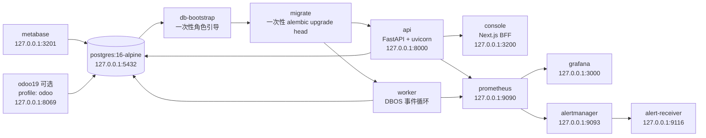

# infra — 部署与运维

本目录承载 commerce-orchestrator 的容器化部署、数据库初始化与可观测性栈：

```
infra/
├── README.md                    # 本文件：拓扑、启动/停止、环境变量、FAQ
├── postgres/
│   ├── init.sql                 # Postgres 首次初始化（DBOS/metabase/odoo 库 + pgcrypto）
│   └── bootstrap.sql            # 幂等角色/权限引导（db-bootstrap 服务执行）
├── prometheus/
│   ├── prometheus.yml           # 抓取 api/worker /metrics（容器内网）
│   └── rules/alerts.yml         # P7 十类告警规则（每条带 runbook_url）
├── grafana/
│   ├── provisioning/            # 预置 datasource（Prometheus）与 dashboard provider
│   └── dashboards/              # 预置 6 块看板（API RED / worker-runtime /
│                                #   workflow-approval / effect-ledger /
│                                #   reconciliation / privacy-cleanup）
├── alertmanager/
│   └── alertmanager.yml         # 影子环境只投递到本地 alert-receiver
├── alert-receiver/              # 本地告警接收器（记录名称/级别/runbook URL）
└── scripts/                     # 部署/运维辅助脚本
```

## 部署拓扑（P7）



### 启动顺序

```text
postgres healthy → db-bootstrap completed → migrate completed
→ api + worker（并行）→ api/worker ready
→ console + prometheus + grafana + alertmanager + alert-receiver + metabase
```

- **postgres**：`postgres:16-alpine`，首次空卷执行 `init.sql`（创建 dbos/metabase/odoo 库、启用 pgcrypto），健康检查 `pg_isready`。
- **db-bootstrap**：一次性服务，幂等执行 `bootstrap.sql`——创建最小权限角色、移交应用库所有权、设置默认授权；覆盖非空卷升级场景。
- **migrate**：一次性服务，与 api/worker 同一镜像，以 `commerce_migrator` 角色执行 `uv run alembic upgrade head`；API/worker 启动时不自行改 schema。
- **api**：FastAPI 应用（`uv run uvicorn app.main:app`），对外 127.0.0.1:8000；healthcheck 命中 `/readyz`（WP6 实现：数据库、Alembic head、adapter 配置、worker heartbeat）。
- **worker**：与 api **同一镜像**、不同进程（`uv run python -m app.worker`），跑 DBOS 工作流/队列，不暴露端口；独立 Docker healthcheck（主进程存活 + postgres 可达；WP4 保证 bootstrap/DBOS launch 失败时进程非零退出）。
- **console**：Next.js 控制台（`console/Dockerfile`），服务端私有 `COMMERCE_API_BASE=http://api:8000`，BFF 安全会话（WP2）。
- **prometheus**：抓取 `api:8000/metrics` 与 `worker:9101/metrics`（worker 端口为 WP4 契约），加载 `rules/alerts.yml`。
- **grafana**：预置 Prometheus datasource 与 6 块 dashboard（provisioning 方式）。
- **alertmanager**：影子环境只投递到仓库内本地 `alert-receiver`（不投外部渠道）。
- **alert-receiver**：记录告警名称/级别/runbook URL（不记录业务 payload），写入命名卷 `alert-logs` 与 stdout。
- **metabase**：自身应用库用独立角色 `metabase_app`；业务库连接在 Metabase 管理界面配置，**必须使用 `commerce_readonly`（仅 SELECT）**，不得用 owner/app 写账号。
- **odoo19**：默认**不启动**（profile `odoo`），使用独立数据库 `odoo` 与角色 `odoo_app`。
- v1 明确**不使用** Redis / RabbitMQ / Kafka / Elasticsearch / Kubernetes；异步/幂等能力由 DBOS + PostgreSQL 提供。

## 数据库最小权限角色

由 `infra/postgres/bootstrap.sql` 幂等创建（口令为**开发占位符**，与 `.env.example`/`compose.yaml` 一致；影子/生产必须用 secret 注入真实口令）：

| 角色 | 用途 | 连接对象 |
| --- | --- | --- |
| `commerce`（既有 owner，兼容保留） | 容器超级用户/兼容旧部署 | — |
| `commerce_migrator` | Alembic DDL（CREATE TABLE 等） | migrate 服务 |
| `commerce_api` | command/webhook/decision 及读取 | api（`COMMERCE_API_DATABASE_URL`） |
| `commerce_worker` | workflow/domain/effect/reconciliation 写权限 | worker（`COMMERCE_WORKER_DATABASE_URL`） |
| `commerce_readonly` | 仅 SELECT projection/view | Metabase 业务库连接 |
| `dbos_app` | DBOS 系统库（dbos） | api/worker（`COMMERCE_DBOS_SYSTEM_DATABASE_URL`） |
| `metabase_app` | Metabase 自身应用库（metabase） | metabase（`MB_DB_*`） |
| `odoo_app` | Odoo 数据库（odoo） | odoo19（`USER`/`PASSWORD`） |

授权策略：`commerce_migrator` 建的表/序列通过 `ALTER DEFAULT PRIVILEGES` 自动按角色授权（api/worker 读写、readonly 仅 SELECT）；各应用库所有权与 public schema 归属对应 app 角色。PostgreSQL 15+ 下 public schema 不再默认对任意角色开放写权限。

## 快速开始

### 0. 准备 .env（必做）

```bash
# Linux/macOS
cp .env.example .env
```

```powershell
# Windows PowerShell
Copy-Item .env.example .env
```

`.env.example` 是**变量名的单一事实来源**，每个变量都有注释；把真实密钥填进 `.env`（已被 git 忽略）。

### 1. 启动完整栈（空数据卷自动迁移）

```powershell
# Windows PowerShell
docker compose up -d
```

```bash
# Linux/macOS（make 可选；Windows 请直接用上面的 docker compose 命令）
make dev-up
```

空数据卷首次启动会自动执行 `init.sql → db-bootstrap → migrate`，随后 api/worker 进入 ready 后启动 console 与监控栈。等价手动命令（Windows 无 make 时逐条执行）：

```powershell
docker compose up -d                      # 启动（含一次性 db-bootstrap/migrate）
docker compose up migrate                 # 仅重跑迁移（migrate-compose）
docker compose up db-bootstrap            # 仅重跑角色引导（bootstrap-db）
docker compose down                       # 停止并移除容器（保留数据卷）
docker compose logs -f --tail=100         # 日志
docker compose build                      # 重建镜像
```

启动后访问：

| 服务 | 地址 |
| --- | --- |
| API（readyz） | http://localhost:8000/readyz |
| Console | http://localhost:3200 |
| Prometheus | http://localhost:9090 |
| Grafana | http://localhost:3000（admin/`GRAFANA_ADMIN_PASSWORD`，默认 grafana） |
| Alertmanager | http://localhost:9093 |
| Metabase | http://localhost:3201 |
| Odoo 19（需先启用 profile） | http://localhost:8069 |

### 2. 启用 Odoo 19（可选）

```bash
# 启动完整栈 + Odoo
docker compose --profile odoo up -d

# 仅启动 Odoo（其余服务已在运行）
docker compose --profile odoo up -d odoo19

# 停止
docker compose --profile odoo down
```

Odoo 使用独立数据库 `odoo` 与角色 `odoo_app`（与业务主库 `commerce` 隔离）。

### 3. 本地开发（不经 Docker）

```bash
# Linux/macOS
make setup          # backend: uv sync + console: npm ci
make migrate        # cd backend && uv run alembic upgrade head
make test           # uv run pytest
make lint           # uv run ruff check / format --check
make console        # cd console && npm run dev
```

```powershell
# Windows PowerShell 等价命令
cd backend; uv sync --frozen --extra dev; cd ..
cd backend; uv run alembic upgrade head; cd ..
cd backend; uv run pytest; cd ..
cd console; npm run dev; cd ..
```

裸机本地开发使用 owner 角色 `commerce`（`COMMERCE_DATABASE_URL`）；如需最小权限角色连接，先对本地库执行 `infra/postgres/bootstrap.sql` 并改用 `COMMERCE_API_DATABASE_URL` / `COMMERCE_WORKER_DATABASE_URL`。

## 监控与告警

- Prometheus 规则：`infra/prometheus/rules/alerts.yml`（十类告警：worker unavailable / inbox backlog / failed inbox / outcome_unknown / API 5xx / API p99 / reconciliation incomplete / reconciliation drift / cleanup overdue / approval expiry risk），每条带 `runbook_url` 注解。
- Grafana 看板：provisioning 自动加载 `infra/grafana/dashboards/` 下 6 块 JSON。
- 告警出口：Alertmanager → 本地 `alert-receiver`（只记录 alert 名称/级别/runbook URL，不记录业务 payload；日志在 stdout 与命名卷 `alert-logs`）。生产外部通知渠道留待切换阶段指定。
- 指标名契约：规则/看板引用的 `commerce_*` 指标由 WP4/WP5/WP6 落地（清单见 WP3-REPORT）；指标未落地前规则不产生数据、不误报。

## 环境变量说明

全部变量名及注释见根目录 **`.env.example`**（权威文件），要点：

- `COMMERCE_*`：backend 应用配置（`config.py` 通过 `COMMERCE_` 前缀读取），包括数据库 URL、JWT、Fernet 加密密钥、Shopify/Odoo 连接、inbox/effect 参数、PII HMAC key、console origin、OTLP 与负载保留天数。
- `POSTGRES_*`：仅 compose 插值使用（默认 `commerce`/`commerce`/`commerce`）；修改需同步 `COMMERCE_*_DATABASE_URL` 与 metabase/odoo 配置。
- 角色口令占位符：`commerce_api`/`commerce_worker`/`commerce_migrator`/`commerce_readonly`/`dbos_app`/`metabase_app`/`odoo_app`（与 `bootstrap.sql` 一致）。
- `DBOS__*`：可选；以 backend 的 DBOS 初始化代码为准。
- 容器内数据库主机名是 `postgres`；`.env` 中的 `localhost` 值仅供本地裸机开发，compose 已在 api/worker 服务内用 `environment` 覆盖为服务名。

## 常见问题

### 端口占用（5432 / 8000 / 3200 / 9090 / 3000 / 9093 / 3201 / 8069）

```powershell
Get-NetTCPConnection -LocalPort 5432,8000,3200,9090,3000,9093,3201,8069 -State Listen | Select-Object LocalAddress,LocalPort,OwningProcess
```

若本机已有 Postgres 占用 5432，可临时改 compose 映射，例如 `"5433:5432"`，并同步修改 `.env` 中 `COMMERCE_DATABASE_URL` 的端口。监控栈宿主端口可用 `.env` 的 `API_PORT`/`CONSOLE_PORT`/`PROMETHEUS_PORT`/`GRAFANA_PORT`/`ALERTMANAGER_PORT`/`ALERT_RECEIVER_PORT`/`METABASE_PORT` 覆盖。

> 注意：若本机已运行同名独立容器（如全局监控栈的 prometheus/grafana/alertmanager），compose 服务 `container_name` 已加 `commerce-` 前缀避免命名冲突，但宿主端口仍可能冲突，启动前请用上面的命令确认并调整端口。

### Metabase 初始化

- 首次启动 Metabase 需要约 30–60 秒初始化（创建 `metabase` 库表、生成管理员流程），访问 http://localhost:3201 时请耐心等待。
- `metabase` 数据库由 `init.sql`/`bootstrap.sql` 自动创建并归 `metabase_app`。
- 业务库连接在管理界面中配置：**使用 `commerce_readonly`（仅 SELECT）**，禁止使用 owner/app 写账号。
- 忘记管理员密码：`docker compose exec metabase` 内用 Metabase 的 `reset-password` 命令处理（见 Metabase 官方文档）。

### `docker compose` 报 `.env` 缺失 / 变量为空

忘记 `cp .env.example .env`。`api`/`worker`/`migrate` 使用 `env_file: .env`，文件必须存在。

### 数据卷与重新初始化

- `pgdata` 卷保存全部数据库数据；`docker compose down` 不删卷。
- 如需彻底重置数据库（会丢数据）：`docker compose down -v` 后再 `up`，此时 `init.sql` 会重新执行一次。
- 角色/权限在非空卷上通过 `docker compose up db-bootstrap` 幂等重放。

### Odoo profile 用法

```bash
docker compose --profile odoo up -d
```

不加 `--profile odoo` 时 Odoo 不会启动，这是刻意设计（P0 验证用，默认不进日常栈）。
