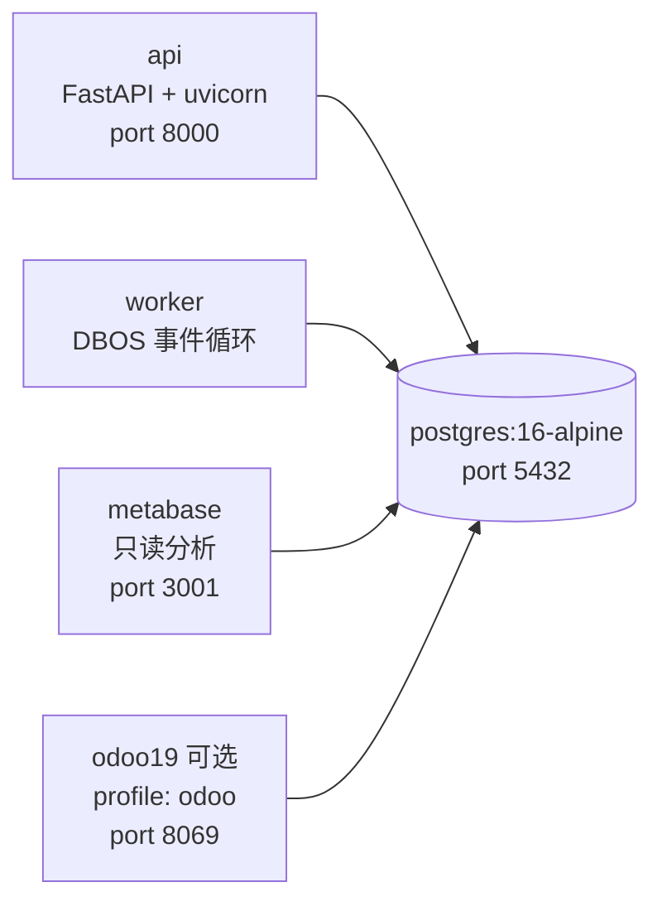

# infra — 部署与运维

本目录承载 commerce-orchestrator 的容器化部署与数据库初始化：

```
infra/
├── README.md            # 本文件：拓扑、启动/停止、环境变量、FAQ
├── postgres/
│   └── init.sql         # Postgres 首次初始化（DBOS/metabase/odoo 库 + pgcrypto）
└── scripts/             # 部署/运维辅助脚本（当前 v1 无额外脚本）
```

## 部署拓扑（v1）



- **api**：FastAPI 应用（`uv run uvicorn app.main:app`），对外 8000。
- **worker**：与 api **同一镜像**、不同进程（`uv run python -m app.worker`），跑 DBOS 工作流/队列，不暴露端口。
- **metabase**：只读 BI 分析，`MB_DB_DBNAME=metabase`，端口 3001 → 容器内 3000。
- **odoo19**：默认**不启动**（profile `odoo`），仅用于 P0 验证 Odoo 19 JSON-2 API（`/json/2/<model>/<method>` + Bearer API key）。
- v1 明确**不使用** Redis / RabbitMQ / Kafka / Elasticsearch / Kubernetes；异步/幂等能力由 DBOS + PostgreSQL 提供。

## 快速开始

### 0. 准备 .env（必做）

```bash
# Linux/macOS
cp .env.example .env
```

```powershell
# Windows PowerShell
Copy-Item .env.example .env
```

`.env.example` 是**变量名的单一事实来源**，每个变量都有注释；把真实密钥填进 `.env`（已被 git 忽略）。

### 1. 启动完整栈

```powershell
# Windows PowerShell
docker compose up -d
```

```bash
# Linux/macOS（make 可选；Windows 请直接用上面的 docker compose 命令）
make dev-up
```

等价手动命令（Windows 无 make 时逐条执行）：

```powershell
docker compose up -d                      # 启动
docker compose down                       # 停止并移除容器（保留数据卷）
docker compose logs -f --tail=100         # 日志
docker compose build                      # 重建镜像
```

启动后访问：

| 服务 | 地址 |
| --- | --- |
| API（healthz） | http://localhost:8000/healthz |
| Metabase | http://localhost:3201 |
| Odoo 19（需先启用 profile） | http://localhost:8069 |

### 2. 启用 Odoo 19（可选）

```bash
# 启动完整栈 + Odoo
docker compose --profile odoo up -d

# 仅启动 Odoo（其余服务已在运行）
docker compose --profile odoo up -d odoo19

# 停止
docker compose --profile odoo down
```

Odoo 使用独立数据库 `odoo`（与业务主库 `commerce` 隔离），凭据复用 `POSTGRES_*`（默认 `commerce`/`commerce`）。

### 3. 本地开发（不经 Docker）

```bash
# Linux/macOS
make setup          # backend: uv sync + console: npm ci
make migrate        # cd backend && uv run alembic upgrade head
make test           # uv run pytest
make lint           # uv run ruff check / format --check
make console        # cd console && npm run dev
```

```powershell
# Windows PowerShell 等价命令
cd backend; uv sync --frozen --extra dev; cd ..
cd backend; uv run alembic upgrade head; cd ..
cd backend; uv run pytest; cd ..
cd console; npm run dev; cd ..
```

## 环境变量说明

全部变量名及注释见根目录 **`.env.example`**（权威文件），要点：

- `COMMERCE_*`：backend 应用配置（`config.py` 通过 `COMMERCE_` 前缀读取），包括数据库 URL、JWT、Fernet 加密密钥、Shopify/Odoo 连接、OTLP 与负载保留天数。
- `POSTGRES_*`：仅 compose 插值使用（默认 `commerce`/`commerce`/`commerce`）；修改需同步 `COMMERCE_*_DATABASE_URL` 与 metabase/odoo 配置。
- `DBOS__*`：可选；以 backend 的 DBOS 初始化代码为准。
- 容器内数据库主机名是 `postgres`；`.env` 中的 `localhost` 值仅供本地裸机开发，compose 已在 api/worker 服务内用 `environment` 覆盖为服务名。

## 常见问题

### 端口占用（5432 / 8000 / 3001 / 8069）

```powershell
Get-NetTCPConnection -LocalPort 5432,8000,3001,8069 -State Listen | Select-Object LocalAddress,LocalPort,OwningProcess
```

若本机已有 Postgres 占用 5432，可临时改 compose 映射，例如 `"5433:5432"`，并同步修改 `.env` 中 `COMMERCE_DATABASE_URL` 的端口。

### Metabase 初始化

- 首次启动 Metabase 需要约 30–60 秒初始化（创建 `metabase` 库表、生成管理员流程），访问 http://localhost:3201 时请耐心等待。
- `metabase` 数据库由 `infra/postgres/init.sql` 自动创建；若容器在 init 完成前启动，Metabase 会自动重试连接。
- 忘记管理员密码：`docker compose exec metabase` 内用 Metabase 的 `reset-password` 命令处理（见 Metabase 官方文档）。

### `docker compose` 报 `.env` 缺失 / 变量为空

忘记 `cp .env.example .env`。`api`/`worker` 使用 `env_file: .env`，文件必须存在。

### 数据卷与重新初始化

- `pgdata` 卷保存全部数据库数据；`docker compose down` 不删卷。
- 如需彻底重置数据库（会丢数据）：`docker compose down -v` 后再 `up`，此时 `init.sql` 会重新执行一次。

### Odoo profile 用法

```bash
docker compose --profile odoo up -d
```

不加 `--profile odoo` 时 Odoo 不会启动，这是刻意设计（P0 验证用，默认不进日常栈）。
